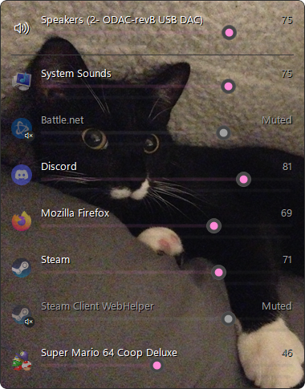
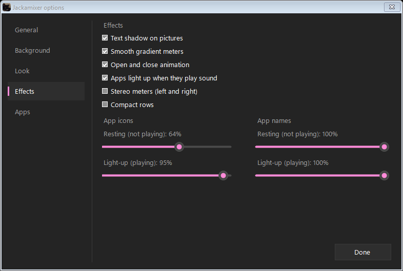

# Jackamixer

A small volume mixer for Windows 10/11 with live level meters. One row per app: slider, mute, and a meter that shows what is actually making noise.



- Press **Win+\\** to open it, press it again (or Esc, or click away) to close.
- No tray icon. A hidden listener holds the hotkey (about 24 MB RAM, 0% CPU while idle); the mixer window only exists while it is open.
- Apps with several processes (browsers, Discord) get one row.
- Apps light up when they play sound: quiet apps fade back, the one making noise stands out.
- Shows what's playing (song or video title and artist, from YouTube, Spotify and the like) with previous / play-pause / next.
- Follows your Windows accent color and light/dark mode, or pick your own colors.
- Optional background picture (drag to position, zoom, darkness) or frosted glass, see-through bars, stereo meters, compact rows.

## Why I made it

The Windows 11 volume mixer gives every app a slider, but it doesn't show how loud each app actually is, so when something starts making noise you're stuck guessing which one it is. If there's an option for that somewhere, I couldn't find it. The old mixer (sndvol) does have meters, but it looks like it's from 2009 and it's buried. So I made my own: one hotkey, a live meter on every app, and nothing sitting in the tray.

## Install

1. Download or clone this folder to where you want it to live.
2. Right-click `install.ps1` > **Run with PowerShell**.

That builds `Jackamixer.exe` with the C# compiler that already ships with Windows (nothing to download), adds **Jackamixer** and **Jackamixer Options** to the Start menu, and starts the hotkey listener now and at every login.

To remove it, run `uninstall.ps1`, then delete the folder.

## Using it

| Do this | To |
| --- | --- |
| Drag the slider, or scroll on a row | change volume (scroll = 2% per notch) |
| Click the app icon, or middle-click the row | mute / unmute |
| Right-click an app > **Hide** | take it out of the mixer (bring it back in Options) |
| Right-click > **Options...**, or Start menu > **Jackamixer Options** | change how it looks and works (see below) |

The meter runs from -60 dB to 0 dB, turns yellow above -6 dB and red above -1 dB; the small tick holds the recent peak.

## Options

While Options is open the mixer stays up next to it and changes as you go, so you can see what you're doing. Everything saves right away; clicking anywhere else closes both.



| Tab | What's there |
| --- | --- |
| General | hotkey (press the keys you want), whether the hotkey **opens** the mixer (click away closes it) or **toggles** it, right-click menu, gear button, show what's playing |
| Background | picture with drag-to-move, zoom and darkness; frosted glass (your blurred wallpaper) when there's no picture |
| Look | use Windows colors, or your own accent color and dark/light background; bar opacity (when light-up is off), and whether the slider knobs fade with it |
| Effects | text shadow, smooth gradient meters, open/close animation, stereo meters, compact rows, and "apps light up when they play sound" with resting and light-up opacity for icons, names and bars |
| Apps | tick or untick which apps show in the mixer |

Why is iCUE (or Discord, OBS, Wallpaper Engine) bouncing when it isn't making sound? Apps with audio-reactive features listen to your speakers, Windows lists that as a session on your speakers, and its meter shows everything it hears. Hide it if it bugs you.

## Settings file

Everything is saved in `Jackamixer.ini` next to the exe. You normally never touch it (the file explains each line), but you can; after editing it by hand, run `Jackamixer.exe --reload`.

```ini
hotkey=Win+\
hotkey_mode=close
background=C:\Pictures\something.png
background_dim=55
use_windows_colors=1
accent=#FF8AD8
icon_glow=1
icon_idle=55
icon_lit=100
bar_idle=100
bar_lit=100
now_playing=1
hidden_apps=icue.exe
```

## Command line

| Command | Does |
| --- | --- |
| `Jackamixer.exe` | open the mixer (starts the listener if it is not running) |
| `Jackamixer.exe --options` | open the options window |
| `Jackamixer.exe --background` | start only the hotkey listener |
| `Jackamixer.exe --reload` | re-read the hotkey from the ini |
| `Jackamixer.exe --quit` | stop the listener |
| `Jackamixer.exe --snapshot out.png` | render the mixer to a picture (`--snapshot-options out.png 3` renders the options window on tab 3) |

## Building

`build.cmd` compiles `Jackamixer.cs` (the whole app, one file) with `%WINDIR%\Microsoft.NET\Framework64\v4.0.30319\csc.exe`. "Now playing" uses Windows' own media API through the metadata files in `%WINDIR%\System32\WinMetadata`, which every Windows 10/11 PC has. The icon is `assets\jackamixer.ico`.

## License

MIT
